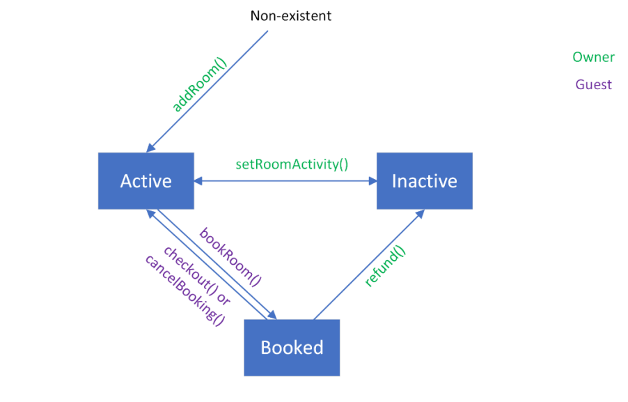

# Booking Rooms

## Summary

When guesthouse owners want to rent their rooms, they mostly have to do it through some middleman (e.g. 
Booking.com). Although such middlemen offer good services, they take additional fees and often leave the 
guesthouse owners and their visitors dissatisfied. Moreover, if there’s a problem with the middleman (e.g. their server 
is down), the room owners’ business might be harmed. 

However, all these problems can be solved with the help of smart contracts that will run on the blockchain, have no 
single point of failure, and take the middleman completely out of the image.

## Smart Contracts

### Rooms
This contract is used for storing and managing the data of the rooms that are to be rented. For this, the struct `Room` 
is used, as well as different mappings. The owners can add and modify their rooms. The room may be marked 
active/inactive which means if it is being rented or not.

Different modifiers are used to limit the access to different functions to only relevant users.

### Bookings

This contract inherits from the `Rooms` contract, thus getting access to all its functionality. It is used for getting booking 
requests from the guests, storing them, and booking rooms accordingly. The struct `Booking` is used for storing the 
booking data. The guest can book a room by invoking the `bookRoom` function. She will have to pay the full fee in 
advance. This money will remain in the smart contract until the guest checks out, after which the money will be 
transferred to the owner’s address. However, if the guest decides to cancel the booking, part of the money will be 
returned to her while the other part will be sent to the room owner for compensation of loss of potential guests. If a 
room is booked by someone, but the owner decides to make it inactive, the whole amount of money paid by the guest 
will be returned.

### Room State Flow

This flowchart describes how the state of each room changes, which functions can be used for which transitions, and 
who has access for calling each function.

_Note: Owner here refers to the room owner, not the contract deployer._

## Benefits

- No middleman: the process of booking and renting a room is automated with a smart contract, and because it 
runs on a blockchain, no flaws will occur because of middlemen.
- Cheaper: the only price the room owners and guests will need is the price for the gas spent by the functions they 
call.
- Clearness: the smart contracts clearly state the terms of the agreement between the room owner and the guest
(in this case, for example, the fact that if the guest books the room carelessly and then decides to cancel, she 
will be charged part of the money)

